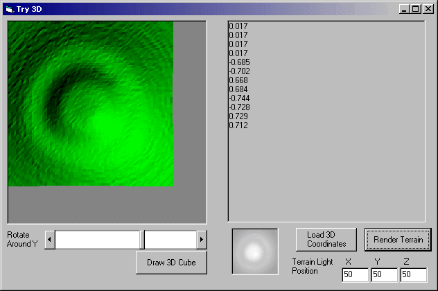

<div align="center">

## A 3D engine primer/landscape/lighting effects


</div>

### Description

This example is kind of a compilation. It shows how to create a 3D view and allow you to rotate a solid cube. I also created a method to create landscape meshes from an image(voxel to polygon?). If 3D is not your thing, you may be able to use the landscape code to create a lighting effects tool similar to photoshop. Source is somewhat commented, Includes Back Face Culling; Lighting using Point lights in space; One single API to draw filled polygons. Please leave comments, questions, problems... vote if you like...
 
### More Info
 
It helps to have a basic understanding of 3D vectors and operations of.


<span>             |<span>
---                |---
**Submitted On**   |2004-06-29 04:35:02
**By**             |[Erik Stites](https://github.com/Planet-Source-Code/PSCIndex/blob/master/ByAuthor/erik-stites.md)
**Level**          |Intermediate
**User Rating**    |5.0 (25 globes from 5 users)
**Compatibility**  |VB 5\.0, VB 6\.0
**Category**       |[Graphics](https://github.com/Planet-Source-Code/PSCIndex/blob/master/ByCategory/graphics__1-46.md)
**World**          |[Visual Basic](https://github.com/Planet-Source-Code/PSCIndex/blob/master/ByWorld/visual-basic.md)
**Archive File**   |[A\_3D\_engin1763616292004\.zip](https://github.com/Planet-Source-Code/erik-stites-a-3d-engine-primer-landscape-lighting-effects__1-54657/archive/master.zip)

### API Declarations

```
Public Declare Function Polygon Lib "gdi32" (ByVal hdc As Long, lpPoint As POINTAPI, ByVal nCount As Long) As Long
```


